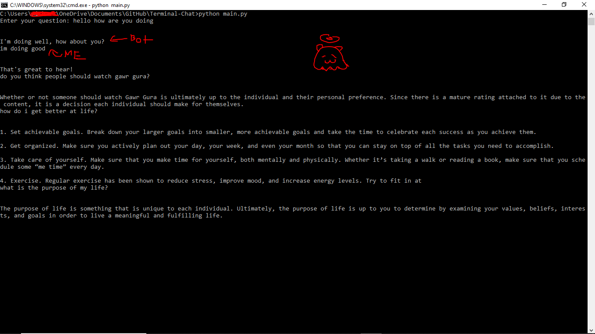

## Prerequisites 
* Python
* PIP
* Acess to a terminal, whether it be command prompt, a python terminal, shell, etc.
* An OpenAI API Key

## Setup
<a href="https://platform.openai.com/docs/quickstart/build-your-application">Get an OpenAI API key</a> if you don't already have one (scroll down to where it says:
``Copy your secret API key and set it as the OPENAI_API_KEY in your newly created .env file. If you haven't created a secret key yet, you can do so below.``

```
$ pip install openai
$ git clone https://github.com/FireStreaker2/Terminal-Chat.git
```
Open up ``main.py`` and add your API key to line 7
```
$ cd Terminal-Chat
$ python main.py
```
Start talking!

note: commands may vary if you're using the python terminal.

## FAQ
Q: Why did you make this?  
A: idk lmao

Q: How long did this take you?  
A: 5-10 minutes i think

Q: You suck at coding  
A: i know

## Example


## Credits
<a href="https://platform.openai.com/docs/quickstart/build-your-application">OpenAI Tutorial</a>   
<a href="https://platform.openai.com/docs/introduction/overview">GPT 3 API</a>

## License
<a href="https://github.com/FireStreaker2/Terminal-Chat/blob/main/LICENSE">MIT</a>
